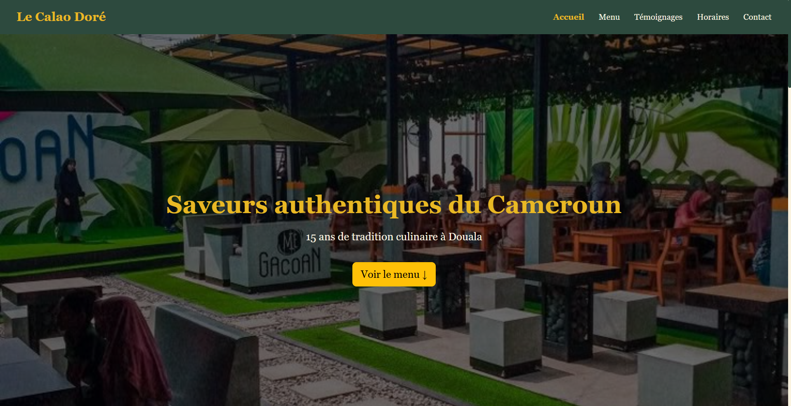
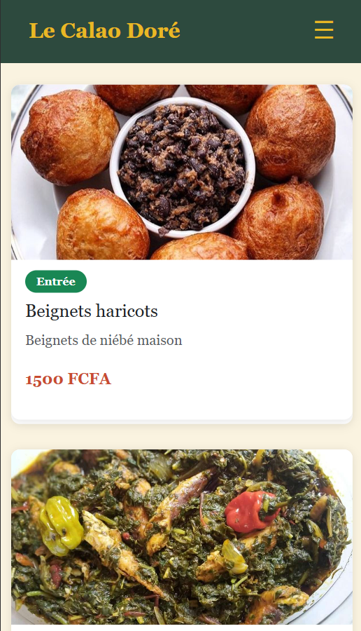

#  Le Calao Doré — Restaurant Camerounais

> Site vitrine d'un restaurant traditionnel camerounais à Douala.  
> Projet réalisé dans le cadre d'**Angular Talent Lab 2026**.

---

## 📸 Captures d'écran

### Desktop


### Mobile


---

## 🛠️ Technologies utilisées

- Angular 22
- Bootstrap 5.3.8
- Bootstrap Icons
- TypeScript 5.9+

---

## ✅ Fonctionnalités

- ✅ Layout responsive (Desktop / Tablette / Mobile)
- ✅ Menu burger mobile
- ✅ Carte des plats avec badges dynamiques
- ✅ Témoignages avec étoiles dynamiques
- ✅ Horaires avec badge jour actuel
- ✅ Footer 3 colonnes avec icônes
- ✅ Palette de couleurs camerounaise

---

## 🚀 Lancer le projet

```bash
git clone https://github.com/Pakistant/le-calao-dore.git
cd le-calao-dore
npm install
ng serve --port 8080 --open
```

Ouvrir [http://localhost:8080](http://localhost:8080)

---

## 👤 Auteur

**STEVE DOUANLA** — Apprenant Angular Talent Lab 2026 — Cohorte Douala